# Tactical Chess

체스의 기본 규칙 위에 **기물별 고유 스킬**과 **로그라이크 스타일의 증강(강화) 시스템**을 더한 2인 온라인 대전 체스 게임. Unity 6000.5.0f1 + Photon Fusion 2로 제작 중.

## 게임 개요

일반 체스 규칙(이동/캡처/체크/체크메이트/스테일메이트/캐슬링/앙파상/프로모션)을 그대로 따르되, 나이트·비숍·룩·퀸·킹 각 기물에 쿨타임 기반 고유 스킬을 부여하고, 게임 진행 중(프로모션 발생 시 또는 10턴마다) 두 플레이어가 각자 카드 3장 중 하나를 골라 증강을 쌓아가며 판을 키워가는 방식이다. 참고로 리그 오브 레전드의 "증강" 시스템에서 착안했다.

## 핵심 기능

### 체스 코어
일반 이동, 캡처, 체크/체크메이트/스테일메이트 판정, 캐슬링, 앙파상, 프로모션(폰이 마지막 줄 도달 시 나이트/비숍/룩/퀸 중 선택)까지 기본 체스 규칙을 전부 구현.

### 기물별 고유 스킬 (쿨타임제)
- **나이트 - 위협**: 이동 후 주변 적 1명을 1턴간 이동 불가로 만듦 (쿨타임 4턴)
- **비숍 - 워프**: 이동 전 상하좌우 1칸을 순간이동(공격 불가) (쿨타임 4턴)
- **룩 - 쉴드**: 이동 후 주변 아군 1명을 일정 턴간 무적으로 보호 (쿨타임 6턴)
- **퀸 - 아우라**: 아군이 적을 처치할 때마다 스택 획득, 6스택마다 아군 1명 자동 승급
- **킹 - 지휘**: 이번 턴을 소모해 다음 턴에 지정한 기물을 한 번 더 이동시킴 (쿨타임 8턴)

### 증강(강화) 시스템
총 40종(노말 15 / 레어 12 / 유니크 8 / 레전더리 5), `AugmentData` ScriptableObject로 관리. 프로모션 발생 시 또는 10턴마다 카드 선택 체크포인트가 열리며, 두 팀이 각자 독립적으로 최대 6개까지 보유 가능(팀당 별도 상한). 나이트/비숍 중 하나를 고르는 이진 선택형 증강도 지원.

### 온라인 2인 대전 (Photon Fusion 2)
방 코드를 생성/입력해 입장하는 방식(퀵매치 아님). Host가 White, 참가자가 Black으로 자동 배정되며 팀별로 카메라가 반전되어 보인다. 보드/기물은 하나를 공유하고, 클릭 좌표만 RPC로 중계해 양쪽 클라이언트가 동일한 로직을 재실행하는 방식으로 동기화한다. 턴 진행, 스킬 발동, 카드 선택(증강/승급/이진선택) 결과까지 전부 이 방식으로 동기화되며, 매치 재시작과 타이틀로 나가기 기능도 지원한다.

### UI
스킬 버튼(쿨타임 표시, 내 턴이 아닐 때 반투명 처리), 카드 선택 화면(증강/승급/이진선택 - 팀별 개별 진행, 선택 시 체크 표시 + 대기 상태), 보유 증강 확인 패널(백/흑 토글, 좌우 스크롤), 게임오버 화면(재시작/타이틀로 이동 버튼).

### VFX
위협(적색)/쉴드(청색)/지휘(황색)/워프(연보라)/프로모션(색종이 폭죽) 5종 스킬 이펙트와 기물 선택 시 바닥 이펙트. 위협/쉴드는 실제 효과 지속시간과 정확히 동기화되어 표시된다.

### SFX
이동, 캡처, 턴 종료, 체크 진입, 게임 시작/승리/패배/무승부, 스킬 4종(위협/쉴드/워프/지휘), 프로모션, 스킬 버튼 클릭, 증강 카드 등장/선택 완료까지 총 16개 상황에 효과음이 매핑되어 있다.

## 스크린샷

| 시작 화면 | 방 번호 입력 | 로비 |
| --- | --- | --- |
| 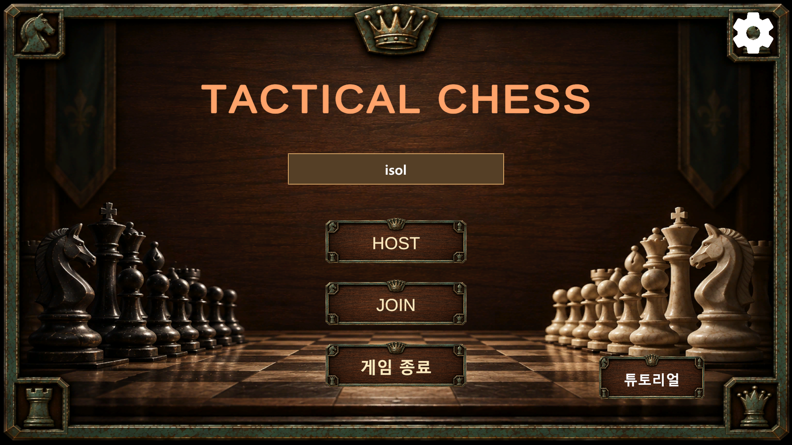 | 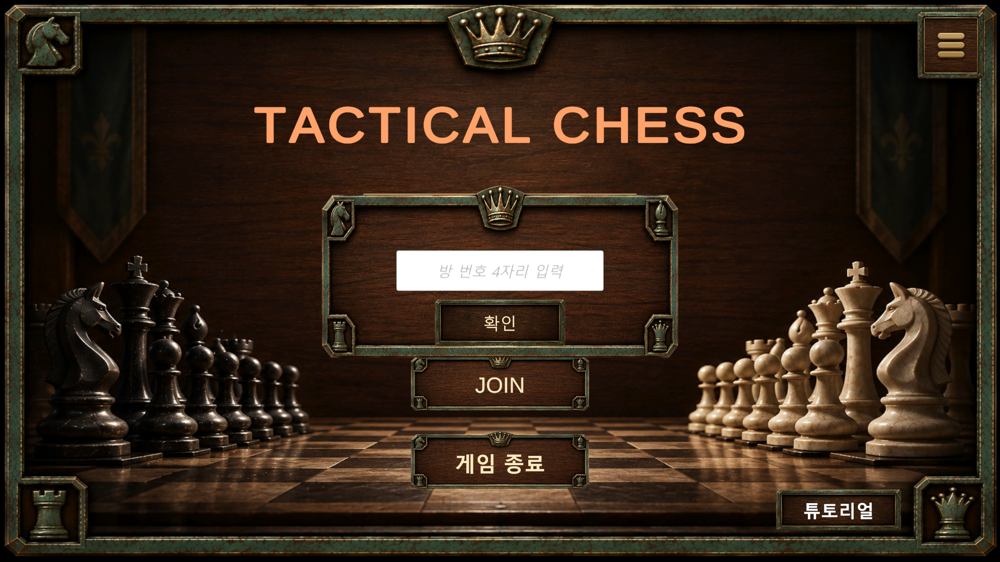 | 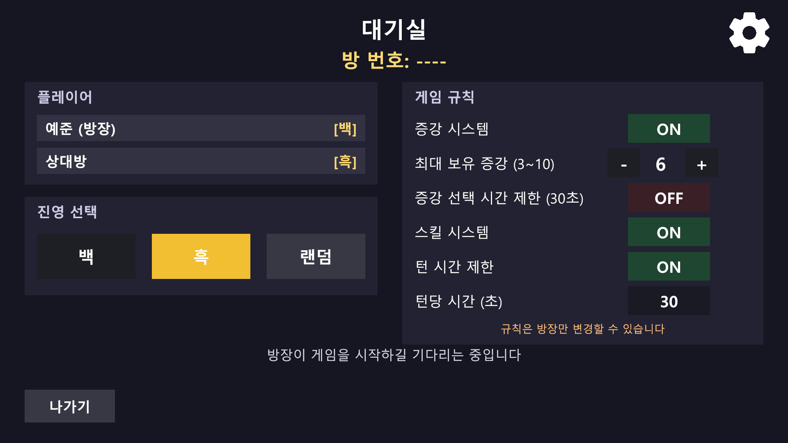 |

| 튜토리얼 - 체스 | 튜토리얼 - 스킬 | 튜토리얼 - 증강 |
| --- | --- | --- |
| 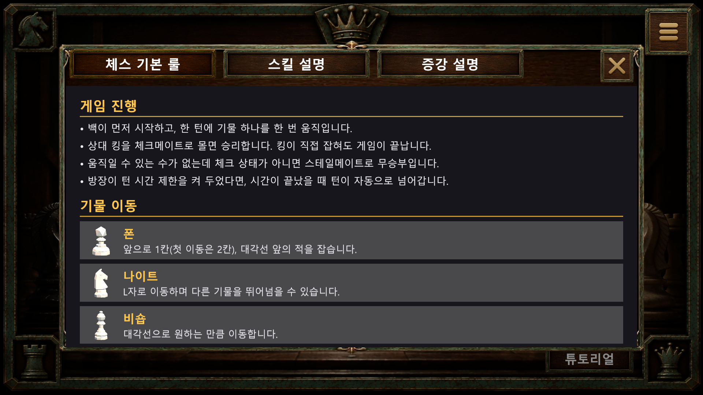 | 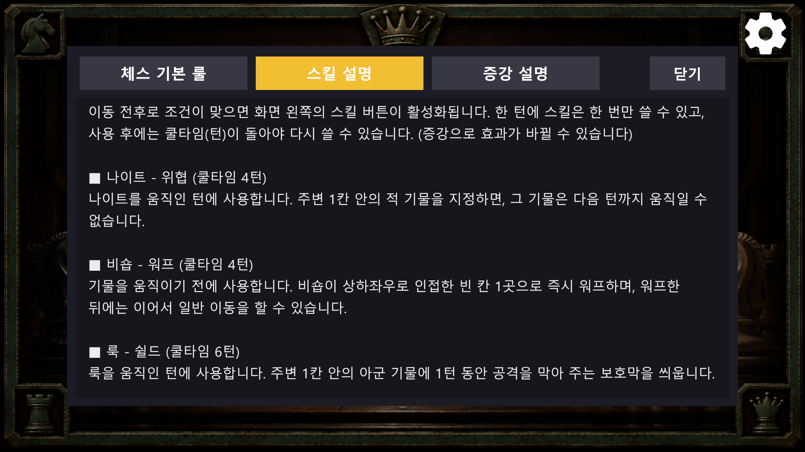 | 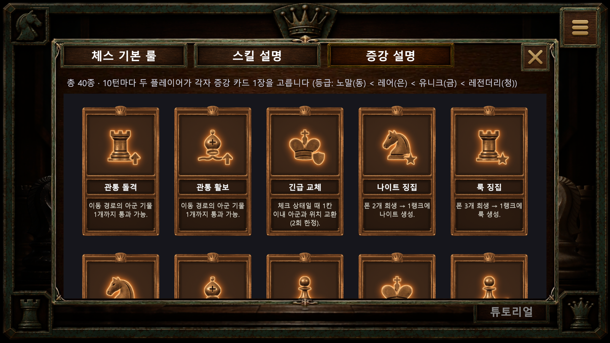 |

| 게임 진행 | 증강 선택 | 프로모션 선택 |
| --- | --- | --- |
| 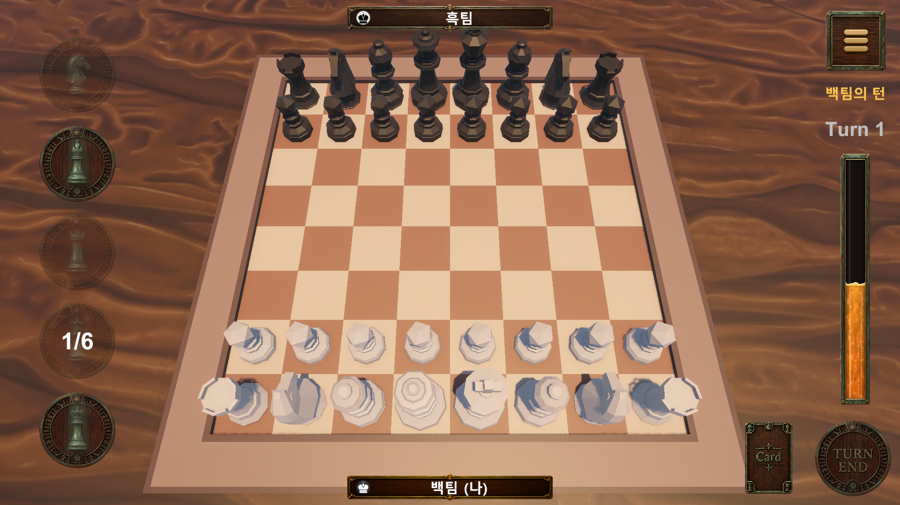 | 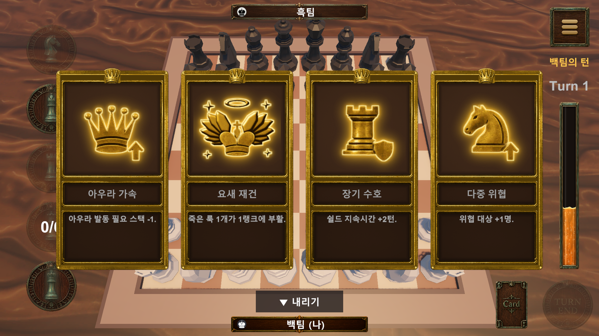 | 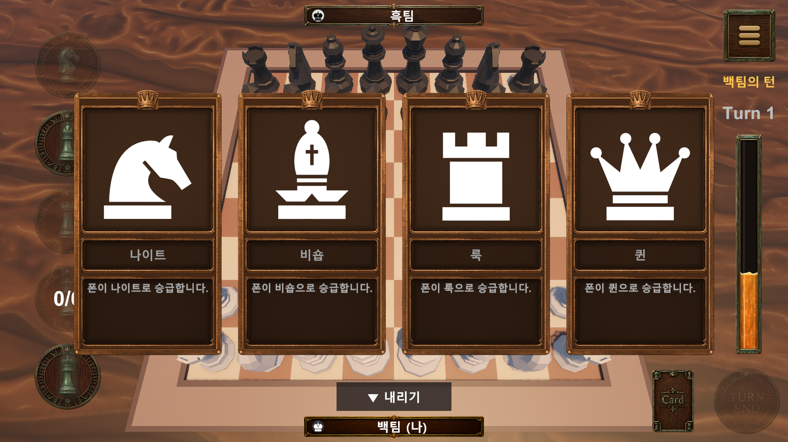 |

| 보유 증강 확인 | 환경설정 | 게임 종료 |
| --- | --- | --- |
| 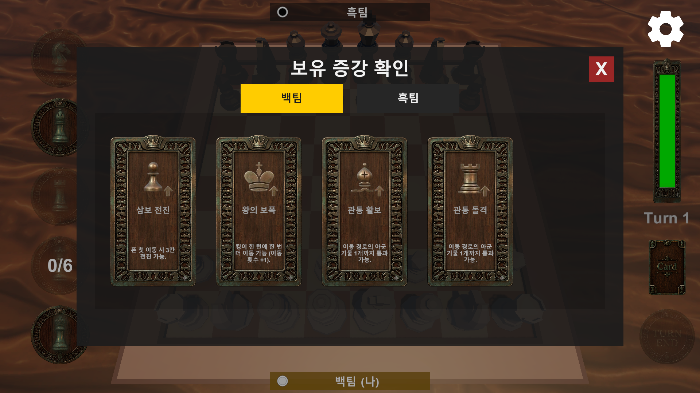 | 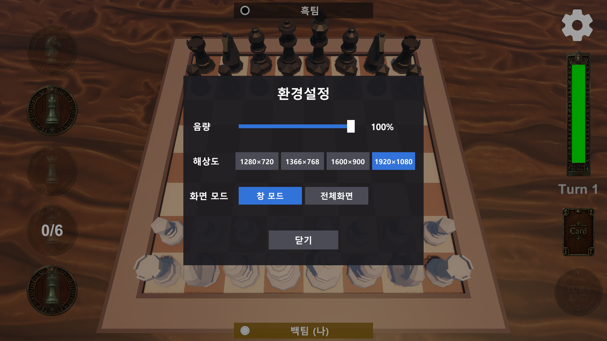 | 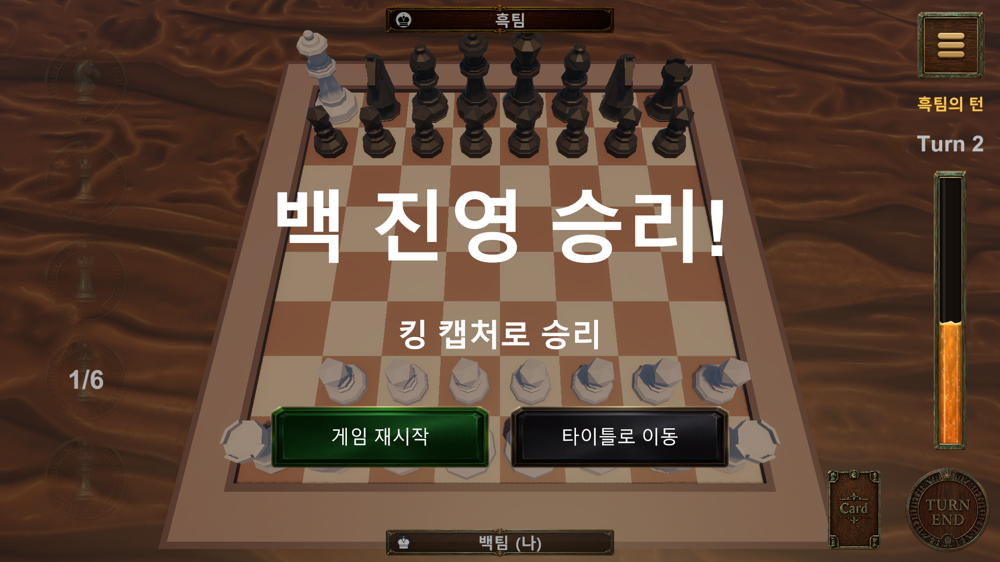 |

## 게임 다운로드

- Windows 64비트 빌드: [Releases](https://github.com/7399moon/Tactical-Chess/releases)에서 `TacticalChess-win64.zip`을 받는다.
- 압축을 풀고 `Tactical Chess.exe`를 실행한다.
- 2인 온라인 대전이라 두 사람 모두 인터넷 연결이 필요하다. 한 명이 방을 만들고(HOST) 방 코드를 알려주면, 다른 한 명이 코드를 입력해 입장한다(JOIN).

## 기술 스택

- **엔진**: Unity 6000.5.0f1 (Universal Render Pipeline)
- **네트워킹**: Photon Fusion 2 (Host-Client 모드, `PeerMode.Single` 환경에서 개발)
- **입력**: Unity Input System
- **언어**: C# (규모가 큰 매니저는 기능별 partial class로 분할)

## 프로젝트 구조

```
Assets/Scripts/
├── Audio/          # SoundManager (SFX 16종 재생)
├── Augment/        # AugmentManager, Augmenteffects (팀별 증강 보유/효과 적용)
├── Card/           # CardSelectionManager(.Data/.Selection/.Timer), CardUI, CardPanelLowerToggle (카드 선택 UI/로직/선택 제한 시간/패널 내리기)
├── Chess/
│   ├── ChessBoard/   # ChessBoard, ChessInteractionManager(.Skills/.Promotion/.CheckState), BoardInputHandler, BoardTileHighlighter
│   ├── ChessPieces/  # PieceMovement, PieceCapture, PIeceSelectionVFX
│   ├── ChessRules/   # ChessRules(.Movement/.Attack) - 이동 합법성/체크 판정
│   └── Pieces/       # Bishop/King/Knight/Pawn/Queen/Rook, ChessPieces
├── Data/           # AugmentData/AugmentDatabase/PromotionOptionData (ScriptableObject)
├── Game/           # GameManager, GameEndManager, GameOverUI
├── Network/        # BasicSpawner, ChessNetworkSync, GameStartController, MatchSettings, PlayerProfile (Fusion 연동/대전 설정/닉네임)
├── Settings/       # SettingsManager, SettingsPanelUI (음량/해상도/전체화면)
├── Skill/          # PieceSkillManager(.Skills/.Status), QueenSkill, SkillUIManager(.TurnState/.SkillHandlers/.UI)
└── UI/             # AugmentViewUI, RoomCodePanelUI, StartMenu, LobbyController, NicknameInputUI, PlayerNameplateUI, TutorialPanelUI

Assets/Data/
├── Augment/        # 증강 40종 .asset
└── Promotion/      # 승급 옵션 4종 .asset (나이트/비숍/룩/퀸)

Assets/Scenes/
├── StartScene.unity   # 타이틀 - 닉네임 입력, 방 생성/코드 입장, 튜토리얼
├── LobbyScene.unity   # 대기실 - 방 코드, 플레이어 목록, 진영 선택, 대전 설정
└── GameScene.unity    # 실제 대국 화면
```

## 개발 진행 상황 (2026-08-24 ~)

| 단계 | 기간 | 내용 |
|---|---|---|
| 1. 체스 기본 구축 | 08-24 ~ 08-27 | 보드/기물 구성, 이동·캡처·체크메이트·캐슬링·앙파상·프로모션 |
| 2. 스킬·증강 구현 | 09-02 ~ 09-14 | 기물별 고유 스킬 5종, 증강 시스템, Photon 설정 |
| 3. 정리와 온라인 대전 | 09-15 ~ 09-18 | 스크립트 정리(partial class 분할), 증강 40종 검증, 팀 분리와 이동 동기화, 첫 2인 실기기 테스트 |
| 4. 버그 수정과 VFX | 09-21 ~ 09-23 | 멀티플레이 버그 수정, 스킬 5종 VFX 제작·연동 |
| 5. 효과음 | 09-28 | SoundManager 구현, 16개 상황에 효과음 적용 |
| 6. 배포 준비 | 09-29 | Git 저장소 생성, 미사용 에셋 정리 |
| 7. 로비와 편의 기능 | 10-01 | 닉네임, 환경설정, 튜토리얼, 로비 씬, 대전 설정 |
| 8. UI 아트 교체 | 10-02 | UI 아트 일괄 교체, 화면 티어링 수정 |
| 9. 스킬 버그 수정 | 10-03 ~ 10-04 | 워프·쿨타임·하이라이트 버그 수정, 화면 중앙 안내문 추가 |
| 10. 시너지 점검 | 10-05 | 왕의 보폭/지휘/승급 상호작용 버그 수정, 환경설정 "게임 나가기" 버튼, UNO 모드 규칙 기획과 카드 스프라이트 추가 |
| 11. 휴전·워프 수정과 UI 정리 | 10-06 | 휴전 협정 중 처형/차원 암살 금지, 위협 상태 비숍 워프 차단, 휴전 남은 턴·현재 턴 표시 추가, 결과 화면 버튼과 환경설정 버튼 정리 |
| 12. 최적화와 버그 수정 | 10-06 | 스크립트·텍스처 최적화(타일 조회, GC 감소, UI 아틀라스), 증강 등급이 매 판 고정되던 문제 수정, 연속 워프 쿨타임·오른쪽 비숍 워프 수정, 증강으로 넓어진 스킬 범위 표시, UNO 모드 구현 계획 수립 |

## 알려진 이슈 / 남은 과제

- 두 플레이어가 정확히 같은 타이밍에 동시 클릭하는 레이스 컨디션은 아직 실기기로 검증 안 됨
- 밸런스: 퀸 라인이 스노우볼 잠재력이 가장 크고, 룩/킹 라인은 레전더리 등급 증강이 부족해 후반 파워 스파이크가 약함

## 빌드 / 실행

- Unity 에디터에서 `Assets/Scenes/StartScene.unity`부터 Play (방 생성 또는 코드 입장)
- Windows 빌드: `Builds/StandaloneWindows64/TacticalChess.exe` (최신 빌드 기준)
